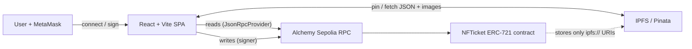

# NFTicket — anti-scalping NFT ticketing

[](https://github.com/mingqinzheng666-lgtm/nfticket/actions/workflows/ci.yml)
[](LICENSE)

Event tickets as ERC-721 NFTs, with the anti-scalping rules enforced **on-chain**
instead of by policy: a hard resale price ceiling, a per-ticket resale count
limit, and check-in that burns a ticket's resale rights. A Solidity contract plus
a React front end, deployed on the Ethereum Sepolia testnet.

> Originally a University of Bristol FinTech group project, refactored into a
> portfolio piece — see [What the refactor covered](#what-the-refactor-covered).


## Live contract

- **Network:** Ethereum Sepolia (testnet)
- **Address:** [`0x7bBfd6cbDf35959649611b6D7A49b8e745b64a8a`](https://sepolia.etherscan.io/address/0x7bBfd6cbDf35959649611b6D7A49b8e745b64a8a)

## Why it's interesting

Scalping is usually fought off-chain (identity checks, transfer bans) and loses.
NFTicket moves the rules into the asset itself. Because each ticket is an NFT whose
transfer logic lives in the contract, the resale ceiling and resale-count cap are
laws of physics for that token — a reseller *cannot* list above the cap or beyond
the allowed number of hops, no matter what UI they use.

- **Resale price ceiling** — every ticket carries a `maxPrice`; `setTicketPrice`
  reverts above it.
- **Resale count limit** — `maxResaleCount` (0 = unlimited) caps how many times a
  ticket can change hands on the secondary market.
- **On-chain check-in** — an authorised staff wallet marks a ticket used; a used
  ticket can't be relisted or resold.
- **Protocol fee** — a 1–10% fee is skimmed on every primary and secondary sale and
  accounted on-chain for the owner to withdraw.

## Architecture



The chain stores only ticketing state and IPFS URIs; heavy data (event info,
posters, seat maps) lives on IPFS. Reads go through a plain RPC provider (no wallet
needed to browse); writes go through the MetaMask signer.

**Roles** form a pyramid enforced by the contract: `owner` (deploys, appoints
staff, withdraws fees) → `admin` (creates / deactivates events) → `check-in staff`
(marks tickets used). A wallet can only ever be appointed once, so admin and staff
roles are permanently mutually exclusive.

## Tech stack

Solidity 0.8.28 · Hardhat · OpenZeppelin Contracts v5 · React 18 · Vite ·
Tailwind CSS · ethers v6 · IPFS / Pinata · Vitest · GitHub Actions

## Repository layout

```text
contracts/     NFTicket.sol — the single ERC-721 ticketing contract
scripts/       deploy, deploy-and-sync, and demo-event seeding
  lib/         pure, unit-tested helpers (seat builder, config sync, validation)
  seed-data/   editable demo event definitions
test/          Hardhat/Mocha tests (contract + script helpers)
frontend/      React + Vite app (own package.json)
  src/utils/   IPFS, entry-pass signing, staff inbox (+ Vitest tests)
```

## Getting started

### Contract (repo root)

```bash
npm install
npm test                 # 66 tests: contract behaviour + script helpers
npx hardhat compile
```

### Front end (`frontend/`)

```bash
npm install
cp .env.example .env     # add your own Pinata JWT + Sepolia RPC URL
npm run dev              # Vite dev server
npm test                 # Vitest unit tests
npm run build
```

Network settings (contract address, target chain, role allowlists) live in
`frontend/src/contract/config.js`.

## Testing

- **Contract & script helpers** (`npm test`, root): full behavioural coverage of
  the contract (primary sale, resale caps, check-in, roles, fees) plus unit tests
  for the pure script helpers.
- **Front end** (`npm test`, `frontend/`): Vitest coverage of the IPFS helpers,
  entry-pass message/signature logic, and the staff-inbox store.
- Every push and PR runs both suites and a production build in
  [GitHub Actions](.github/workflows/ci.yml).

## Automation

Two repeatable workflows sink the error-prone manual steps into one command each:

- **`npm run deploy:sync:sepolia`** — deploys the contract and, in one shot,
  rewrites the address + deploy block in the front-end config, copies the ABI, and
  regenerates the inline human-readable ABI from the compiled artifact — so the
  front end can never drift from the deployed contract. Run it after any change to
  `contracts/*.sol` (a deployed contract is immutable, so edits mean a fresh deploy).
- **`npm run seed:events`** — batch-creates demo events from the editable
  [`scripts/seed-data/events.json`](scripts/seed-data/events.json): uploads an
  on-brand poster, metadata and seat map to IPFS per event, then calls the contract
  with the owner wallet. `SEED_COUNT` / `SEED_FILE` control quantity and source.

## What the refactor covered

Starting from the group coursework, the portfolio refactor focused on:

- **Security** — moved a hard-coded Pinata JWT and RPC key out of source into
  gitignored `.env` files with committed `.env.example` templates.
- **Design** — a full dark "venue before doors" visual system (design tokens,
  reusable component classes, a ticket-stub motif) replacing the default template look.
- **Performance** — parallelised the brute-force on-chain/IPFS data loading and
  added a session cache, cutting cold page loads substantially.
- **Testing & CI** — introduced the front-end test setup, added unit tests, and
  wired up GitHub Actions.
- **Tooling** — the deploy-and-sync and seed automations above.

## Team & attribution

Original SEMTM0029 FinTech group project, University of Bristol:
Mingqin Zheng, Guanxiang Jia, Zhangqingqiu Gu. This repository is Mingqin Zheng's
portfolio refactor of that work.

## Known limitations

Honest about what a production build would need next:

- **Front-end secrets.** Vite inlines `VITE_*` variables into the client bundle, so
  a deployed demo exposes its Pinata upload key to visitors. Acceptable for a
  testnet demo with a scoped key; the real fix is a thin backend that proxies pinning
  so the key never reaches the browser.
- **Entry-pass delivery is simulated.** The ticket holder signs an EIP-191 entry pass
  and staff verify the signature client-side before submitting the on-chain check-in —
  but the pass is handed over through `localStorage`, which only works across tabs of
  one browser. It stands in for a real backend or QR hand-off.
- **Data loading enumerates ids.** Pages walk `0..nextEventId` / `0..nextTokenId`
  rather than reading an index; parallelised and cached, but an indexer (or contract
  events) would scale better.

## Disclaimer

Testnet demo. The deployed contract lives on Sepolia and uses valueless test ETH;
it is not audited and is not intended for production or real funds.

## License

[MIT](LICENSE)
